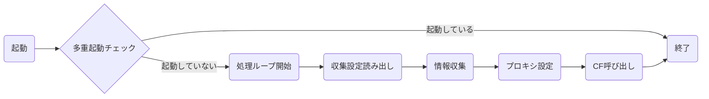

```mermaid
graph LR;
    1(起動)
    2(処理ループ開始)
    3(収集設定読み出し)
    4(情報収集)
    5(プロキシ設定)
    6(CF呼び出し)
    8(終了)

    1-->9{多重起動チェック};
    9-->|起動している|8
    9-->|起動していない|2
    2-->3
    3-->4
    4-->5;
    5-->6;
    6-->8;
```
